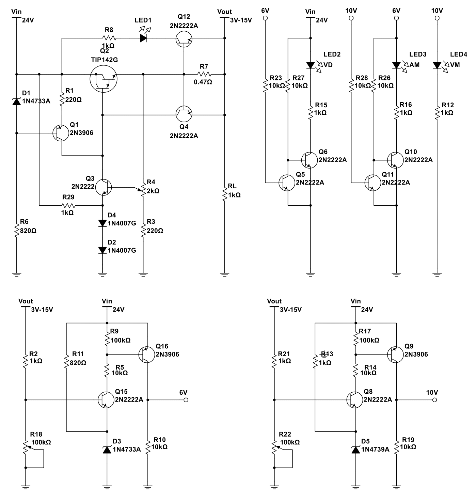

# Regulador de Tensão Linear com Realimentação

Este repositório contém o projeto final da disciplina de **Eletrônica I** do curso de Engenharia da Computação. O objetivo principal foi o desenvolvimento de uma fonte de alimentação linear com realimentação de tensão, que atende aos requisitos especificados de tensão e corrente, além de incluir funcionalidades adicionais, como regulação de carga e monitoramento de tensão.

## Objetivos do Projeto

- Desenvolver uma fonte de alimentação linear capaz de fornecer uma tensão ajustável.
- Implementar um circuito com realimentação de tensão para garantir estabilidade.
- Avaliar a corrente máxima fornecida e a regulação de carga do circuito.
- Incluir um monitor de tensão com indicação visual.
- Comparar resultados calculados, simulados e experimentais.

## Estrutura do Repositório

- **/simulacao**: Contém os arquivos das simulações realizadas no **Multisim®**.
- **/circuitos**: Diagramas esquemáticos do circuito principal e módulos auxiliares.
- **/documentacao**: Relatório completo em LaTeX, incluindo resultados e discussões.
- **/imagems**: Fotos do protótipo montado e capturas de tela das simulações.

## Metodologia

1. **Projeto do Circuito:** O circuito foi projetado para fornecer uma faixa de tensão ajustável que compreende os valores de 3 V a 15 V, com corrente máxima limitada a aproximadamente 1,5 A. A topologia escolhida inclui realimentação para garantir a estabilidade da tensão de saída.

2. **Simulação:** O circuito foi simulado no software **Multisim® 14.2** para validar os cálculos teóricos.

3. **Montagem e Testes:** O circuito foi montado em uma protoboard e testado em diferentes condições de carga para avaliar parâmetros como:
   - Tensão de saída.
   - Corrente máxima fornecida.
   - Estabilidade em relação a variações de carga.
   - Funcionamento do monitor de tensão.

4. **Análise de Resultados:** Os valores medidos foram comparados com os valores calculados e simulados, destacando possíveis discrepâncias e suas causas.

## Resultados Principais

- A fonte de alimentação forneceu uma faixa de tensão ajustável de **2,10 V a 19,35 V**.
- A corrente máxima foi limitada a **1,29 A** devido à influência prática do V\(_{BE}\) do transistor de limitação.
- O circuito apresentou boa **estabilidade de tensão** mesmo sob variações de carga, conforme testes realizados com diferentes resistências.
- O monitor de tensão em janela funcionou conforme o esperado, com transições precisas entre LEDs indicativos.

## Instruções para Reproduzir

1. **Simulação:** Abra os arquivos no **Multisim®** a partir da pasta `simulacao`.
2. **Montagem:** Siga os diagramas esquemáticos disponíveis na pasta `circuitos`.
4. **Relatório:** O relatório completo está na pasta `documentacao`, pronto para visualização ou edição em LaTeX.

## Ferramentas Utilizadas

- **Multisim®:** Para simulação do circuito.
- **Protoboard:** Para montagem física e testes.
- **Osciloscópio e Multímetro:** Para medições de tensão e corrente.
- **LaTeX:** Para geração do relatório técnico.

## Estrutura do Circuito

O circuito principal é composto pelos seguintes módulos:

- Regulador de tensão com realimentação.
- Circuito limitador de corrente.
- Monitor de tensão com comparadores e LEDs indicativos.

### Esquemático Principal

## Conclusão

O projeto final demonstrou o funcionamento eficaz de uma fonte de alimentação linear com realimentação de tensão, destacando-se pela estabilidade e funcionalidade adicionais. Apesar de variações práticas nos valores medidos, os resultados atendem aos requisitos especificados, validando o projeto teórico e a implementação prática.

## Autor

- **Klaus Becker** - Engenharia da Computação - Universidade do Vale do Rio dos Sinos (UNISINOS).

## Licença

Este projeto é de uso acadêmico e está sob a licença MIT. Consulte o arquivo `LICENSE` para mais detalhes.
